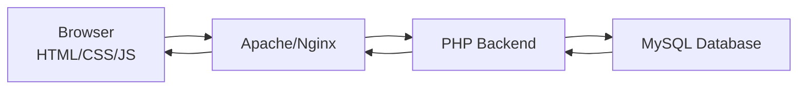
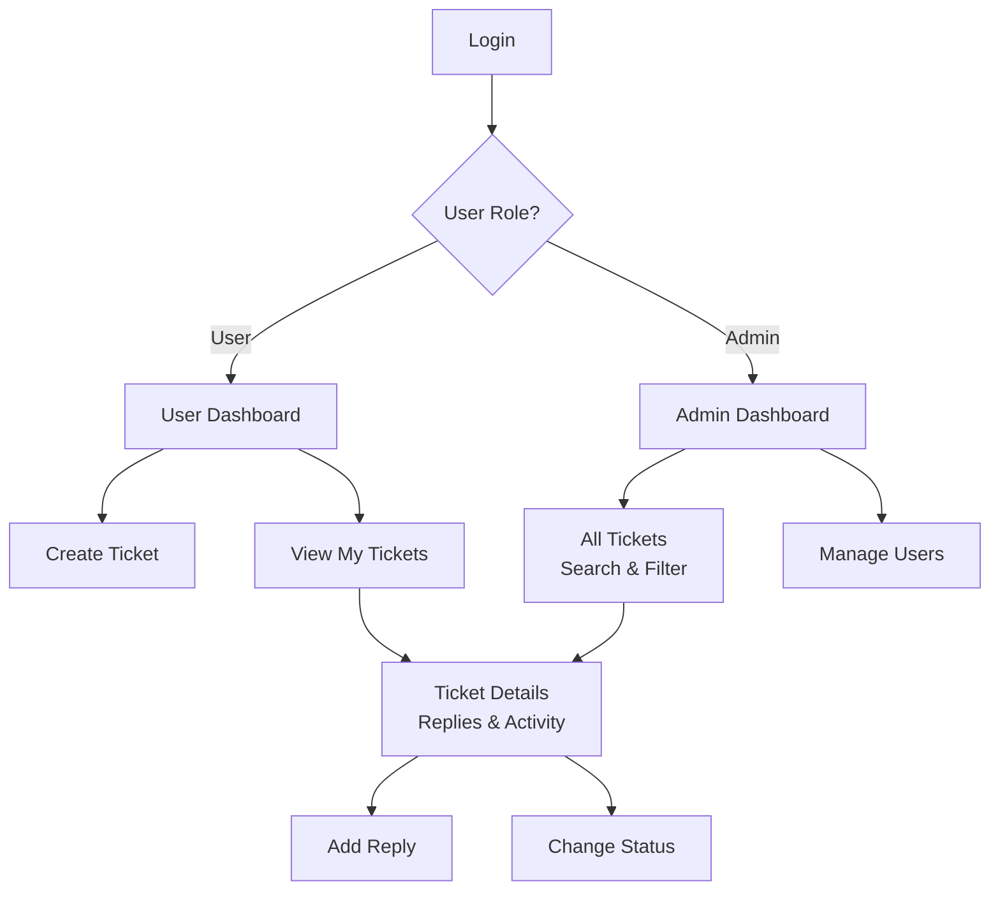
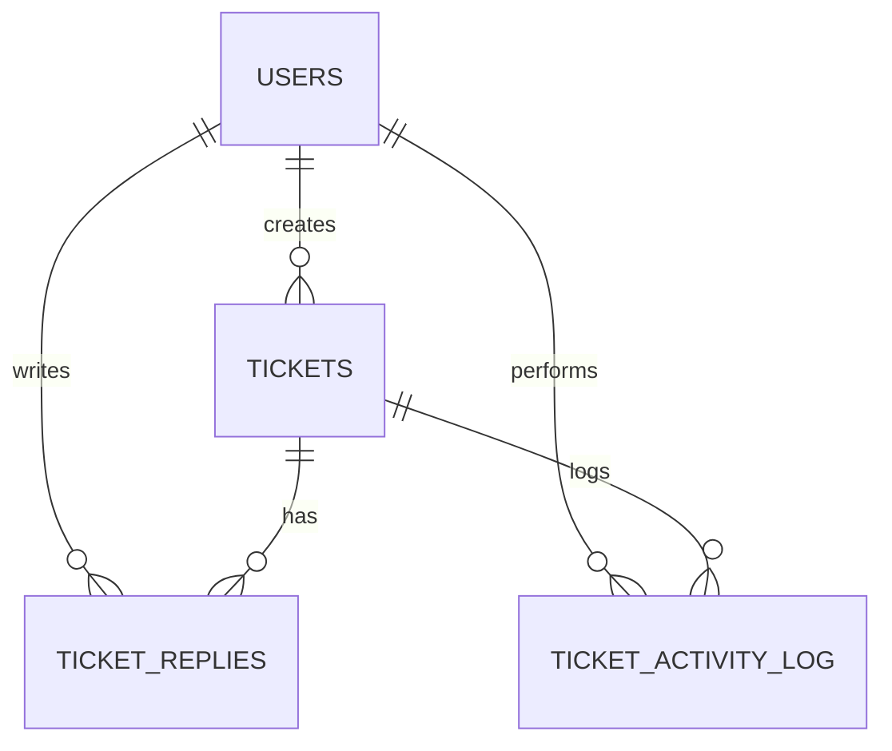

# 💼 IT Helpdesk Ticketing System

**A modern, internal IT support platform built with vanilla PHP, MySQL, and Tailwind CSS – no frameworks, no bloat.**

---

## 📌 Project Description

This system streamles how organizations handle technical support requests. Employees can submit tickets for hardware, software, network, or account issues, while IT staff manage, prioritize, and resolve them through a clean dashboard. Everything runs on a standard LAMP/LEMP stack without third-party libraries, making it lightweight, fast, and easy to audit.

**Real‑world use case:**  
A mid‑sized company needs an internal helpdesk where employees log problems, attach screenshots, and track progress. Admins get a bird’s‑eye view of all tickets, can change statuses, reply, and manage users – all from a single responsive interface that works on desktop and mobile.

---

## ✨ Features

### 👤 User Features
- Create support tickets with category, priority, and detailed description
- Upload screenshots or images (validated file type & size)
- View all own tickets with real‑time status and admin replies
- Filter tickets by status, category, priority, or search by ID
- Paginated ticket list for better performance
- Responsive, mobile‑friendly layout

### 👑 Admin Features
- Dashboard with live statistics (total users, tickets, open tickets)
- View all tickets from every user in a searchable, filterable table
- Change ticket status (Pending → In Progress → Resolved → Closed)
- Post replies that appear instantly on the user’s ticket
- Delete any ticket along with its attachments
- Manage user accounts (list, delete non‑admin users)
- Recent activity log tracking every change and reply

---

## 🛠 Tech Stack

| Layer      | Technology                   |
|------------|------------------------------|
| Frontend   | HTML, CSS, Tailwind CSS CDN, Vanilla JavaScript |
| Backend    | PHP (procedural, no frameworks) |
| Database   | MySQL (PDO with prepared statements) |
| Server     | Apache / Nginx               |
| Libraries  | None – only core web technologies |

> **Design choice:** Tailwind CSS is loaded via CDN for rapid styling; dark/light mode switching uses a simple CSS class and JavaScript cookie.

---

## 🧠 System Architecture

### High‑level flow



### User interaction flow



---

## 🗄 Database Design

### Entity Relationship Diagram



### Tables

- **users** – Stores authentication data and role (`admin` or `user`). Passwords are hashed with bcrypt.
- **tickets** – Core support request with category, priority, status, description, optional attachment filename.
- **ticket_replies** – Messages linked to a ticket and a user; tracks whether the reply came from an admin.
- **ticket_activity_log** – Immutable journal of every action (status change, reply added, ticket created) for full traceability.

All foreign keys enforce referential integrity with `ON DELETE CASCADE`.

---

## 📁 Folder Structure

```
helpdesk/
├── css/
│   └── custom.css               # Minimal extra styles
├── js/
│   └── script.js                # Dark mode toggle, toast, loading states
├── includes/
│   ├── config.php               # Database connection (PDO)
│   ├── auth.php                 # Session & role check helpers
│   ├── functions.php            # Sanitisation, flash messages, activity log
│   ├── header.php               # <head>, Tailwind CDN, nav start
│   ├── sidebar.php              # Role‑based sidebar
│   ├── navbar.php               # Top bar with dark mode button
│   └── footer.php               # Closing tags, toast container
├── uploads/                     # User‑uploaded images (writeable by server)
├── database/
│   └── schema.sql               # Full schema + sample data
├── index.php                    # Redirect based on login status
├── login.php                    # Login form
├── register.php                 # User registration
├── dashboard.php                # Role‑dependant dashboard
├── tickets.php                  # Ticket list (admin/all, user/own)
├── create-ticket.php            # New ticket form & file upload
├── ticket-details.php           # View, reply, activity, admin actions
├── manage-users.php             # Admin user management
├── settings.php                 # Profile & password change
└── README.md
```

---

## 🚀 Installation Guide

1. **Clone the repository** into your web server’s document root.
   ```bash
   git clone https://github.com/providencebyiringiro/it-helpdesk-ticketing-system.git
   ```
2. **Create a MySQL database** and import the schema file.
   ```bash
   mysql -u root -p < database/schema.sql
   ```
3. **Edit `includes/config.php`** and set your database credentials:
   ```php
   define('DB_HOST', 'localhost');
   define('DB_NAME', 'helpdesk_db');
   define('DB_USER', 'root');
   define('DB_PASS', '');
   ```
4. **Ensure the `uploads/` folder is writeable** by the web server.
   ```bash
   chmod 755 uploads
   ```
5. **Start your server** (XAMPP, MAMP, LAMP, etc.) and navigate to the project URL.

6. **Login with the default accounts** (password for all: `password123`).
   - Admin: `admin@company.com`
   - User:  `john@company.com` / `jane@company.com`

The system is ready to use.

---

## 🔮 Future Improvements

While the current version is fully functional, here are realistic enhancements for a production environment:

- **Email notifications** when a ticket status changes or a reply is added
- **Role‑based access control** with more granular permissions (e.g., read‑only agents)
- **RESTful API** for integration with internal tools or a mobile app
- **Advanced reporting** and export (PDF/CSV) of ticket metrics
- **Mobile PWA** version for field support staff
- **Automated ticket assignment** based on category or workload
- **File attachment preview** directly in the ticket view (PDFs, images)

---

## 👤 Author

Developed by BYRINGIRO Providence – a showcase of vanilla PHP and modern front‑end skills without framework dependencies.
